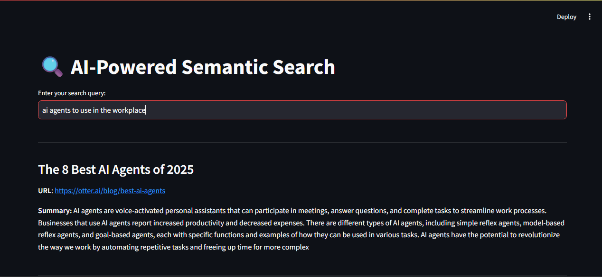

# AI-Powered Semantic Search Summarizer

This is a Streamlit-based web app that combines **semantic search**, **real-time web scraping**, and **GPT-powered summarization** into one workflow. 

Enter any query, and the app will:
- Search the web using **Exa's neural search engine**
- Extract and summarize readable content from web pages
- Handle **YouTube videos** by summarizing their transcripts
- Silently skip irrelevant or unsupported video content (e.g., TikTok, Instagram)

---

## Features

-  Semantic Search (Exa API)
-  AI Summarization (OpenAI GPT-3.5)
-  Video-Aware Logic (YouTube support)
-  Clean UI with Streamlit
-  Secure key management using `.env`

---

##  Demo


  


---

##  Example Queries

- `best productivity tools`
- `how to improve sleep`
- `Philosophy Concepts to Fall Asleep To`

---

##  Tech Stack

- Streamlit
- OpenAI API
- Exa API
- BeautifulSoup
- YouTubeTranscriptAPI
- Python-dotenv

---

##  Setup Instructions

1. Clone this repo
```bash
git clone https://github.com/TegeTigere/my-ai-search.git
cd my-ai-search
```

2. Create a virtual environment and activate it
```bash
python -m venv venv
# On Windows
venv\Scripts\activate
# On macOS/Linux
source venv/bin/activate
```

3. Install dependencies
```bash
pip install -r requirements.txt
```

4. Add your `.env` file (see `.env.example`)
```
OPENAI_API_KEY=your_real_key
EXA_API_KEY=your_real_key
```

5. Run the app
```bash
streamlit run main.py
```

---

##  Notes

- YouTube videos must have transcripts available.
- Instagram and TikTok links are silently skipped.
- GPT token limit is conservative to avoid overuse (you can adjust it).

---

##  Author

Built by Omar Taha  
Connect on [LinkedIn](https://www.linkedin.com/in/omar-taha-133840269/) or [GitHub](https://github.com/TegeTiger)
